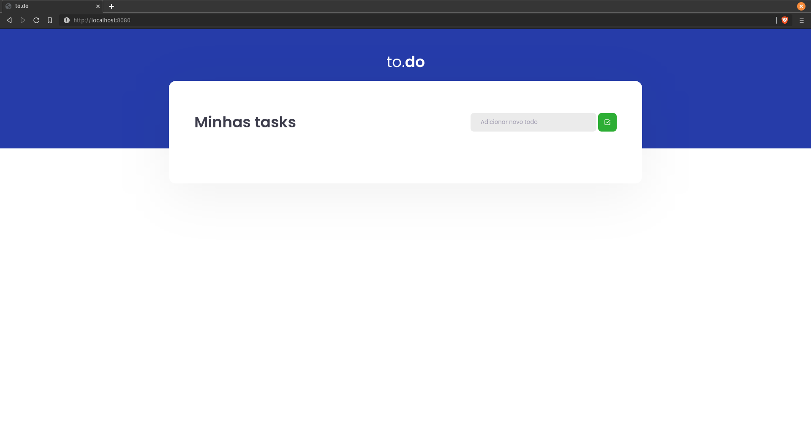
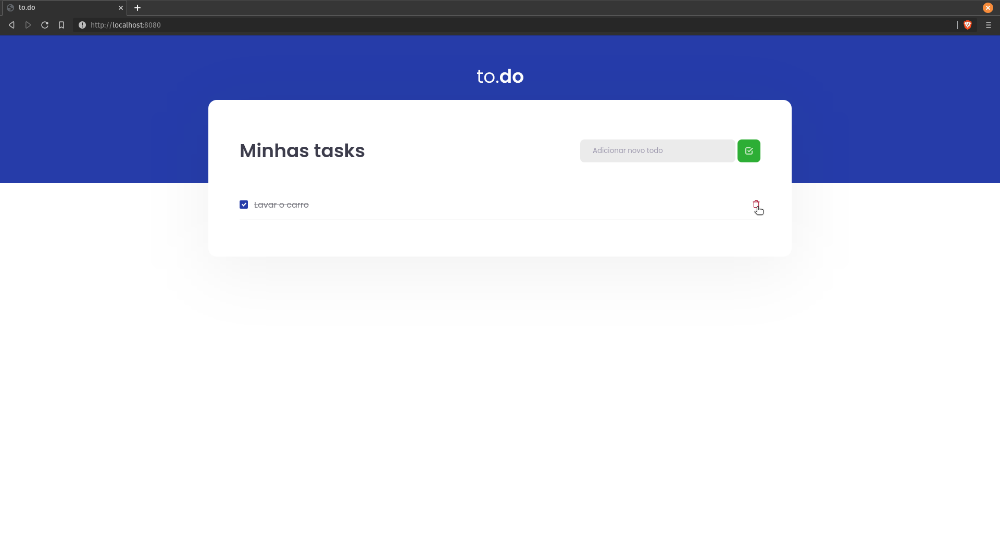

	

## Desafio proposto na trilha React do ignite (Rockeatseat :purple_heart:)

 

 

#### :pushpin: Ideia é criar um simples app no estilo todo list, para aprimorar os conhecimentos. 

#### Principais tecnologias utilizadas Typescript, ReactJS e Sass. :rocket:

#### Para executar o projeto basta clonar o repositório em uma máquina que possua o nodejs, npm e git instalado.

##### PS.: Caso sua máquina não possua o nodejs ou o git você pode estar realizando o download do instalador pelo site oficial: 

NodeJS: https://nodejs.org/en/download/ | Git: https://git-scm.com/downloads

#### :octocat: Para clonar o repositório utilize o seguinte comando no terminal:

>`git clone https://github.com/flavicon/todo-list.git`

#### Após clonar o repositório é preciso entrar no :file_folder: diretório todo-list e baixar todas as :books: bibliotecas presentes no projeto:

> `cd todo-list`

> `yarn`

#### :tada: Para executar o projeto localmente basta excutar o comando: 

>`yarn dev`

> #### A aplicação será executada no endereço http://localhost:8080
